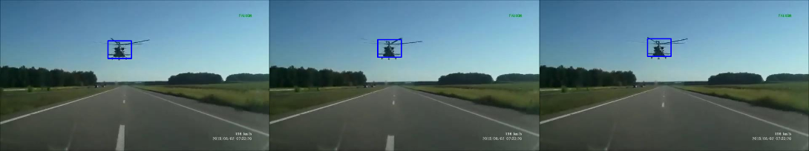

<p align="center">
  
</p>


# 🎯 Frame-Object-Tracker

**Frame-Object-Tracker** is a lightweight computer vision project that detects and tracks a single object across **30 consecutive video frames** using **OpenCV** and **NumPy**.  

It demonstrates essential skills in video frame processing, bounding box tracking, and step-by-step frame visualization in Python.


## Quick Overview

- Tracks one visible object across a short 30-frame video clip.  
- Uses **OpenCV** for frame analysis and **NumPy** for matrix operations.  
- Displays each frame interactively with a bounding box update.  
- Saves output frames for later review in the `output/` folder.  


## How It Works

1. Loads 30 sequential frames from an input folder.  
2. Initializes a bounding box around the target object.  
3. Updates the bounding box per frame using OpenCV operations.  
4. Displays each frame step-by-step or runs continuously.  
5. Saves processed frames with bounding boxes to `output/`.

---
## ⚙️ Input Details

All test cases follow these constraints:
- **Video length:** 30 frames  
- **Frame size:** `1280×720` or `640×360`  
- **Object:** always visible (no occlusion)  
- **Bounding boxes:** overlap between consecutive frames  


## 💻 Run the Project

Example command:
```bash
python main.py C:\_repos\CompVision\Frame-Object-Tracker\tests\0
